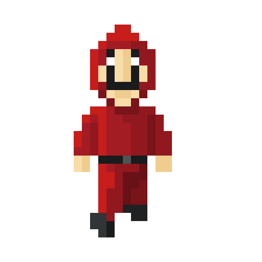
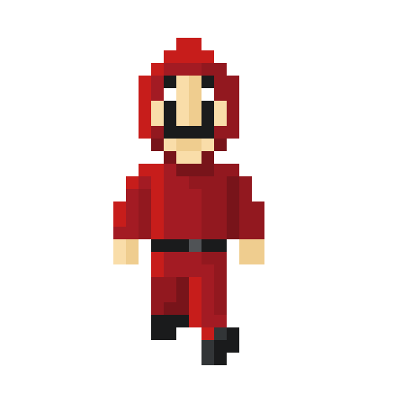

# CHRISTMAS GREETING 2021

### Table of content

1. [The Project](#project)
2. [Planning](#planning)
3. [Images](#images)

## THE PROJECT 

I started studying my Python Course at CICE - Professional School of New Technologies (Madrid) - in October 2020.

In November they launched a challenge to all the students of every different areas since there were from Graphic Design courses to Architecture and Infographic courses. 

### The challenge: 
### To build a Christmas Greeting in any way using skills acquired in the course.

I decided to participate even though I barely knew the basics of python.

I started researching to see what Python would allow me to do. I was just thinking how easy it would be if I were a 3D student, for example.

But suddenly I came across [pygame](https://www.pygame.org/news). Pygame is a set of Python modules designed for writing video games. Pygame adds functionality on top of the excellent SDL library. This allows you to create fully featured games and multimedia programs in the python language. 💡

After watching some tutorials and have been reading for a while, I started creating Christmas Greeting "Game" from scratch.

## PLANNING 

I wanted to create like an interactive video where a **Money Heist** character would recite the message.

And also I wanted to send a message of encouragement since the world was being hit by a pandemic.

First days, while I was still researching about pygame, I downloaded an app in my phone - *8bit Pintor* - which allowed me could draw with pixels. I replace the time I used to spend in social medias for time creating the images I wanted to use for my character and the school logo with some Christmas decoration.

I also recorded the message audio with my phone and I edited it using the app *Super Sound*

### IMAGES 

To make the movement effect I needed the character in different positions so the video would be not more than a combination of all this pictures.

#### The logo

#### The character for the message

#### The character walking down

#### The character walking left

#### The character walking right

#### The character walking up

### VIDEO DEMO

